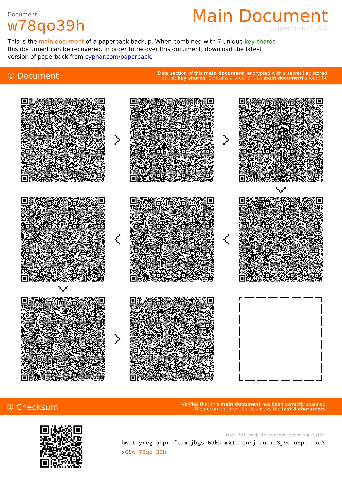
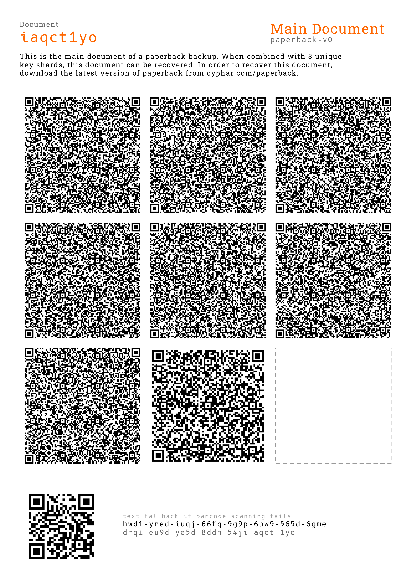
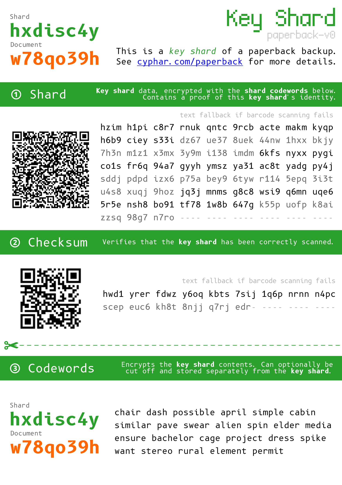
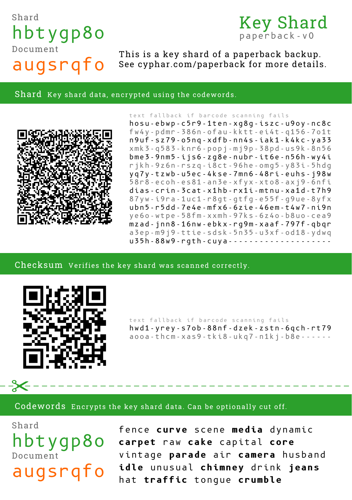

## paperback ##

**NOTE**: While paperback is currently fully functional, all of the development
of "paperpack v0" is experimental and the format of the various data portions
of paperback are subject to change without warning. This means that a backup
made today might not work with paperback tomorrow. However, once there is a
proper release of paperback, the format of that version of paperback will be
set in stone and any new changes will be done with a new version of paperback
(paperback can detect the version of a document, so older documents will always
be handled by paperback).

`paperback` is a paper-based backup scheme that is secure and easy-to-use.
Backups are encrypted, and the secret key is split into numerous "key shards"
which can be stored separately (by different individuals), removing the need
for any individual to memorise a secret passphrase.

This system can also be used as a digital will, because the original creator of
the backup is not required to be present (or consent to) the decryption of the
backup if enough of the "key shards" are collected. No individual knows the
secret key (not even you), and thus no party can be compelled to provide the
key without the consent of `k-1` other parties.

To make this system as simple-to-use as possible, `paperback` creates several
PDFs which you can then print out and laminate, ready for recovery. Here are
some examples of the generated documents:

|               |                                Mockups                                |                           Current Status                           |
| ------------- | :-------------------------------------------------------------------: | :----------------------------------------------------------------: |
| Main Document |  |  |
| Key Shard     |      |      |

These "key shards" can then be given to a set of semi-trusted people.
`paperback` also supports `(k, n)` redundancy, allowing for `n` key shards to
be created but only `k` being required in order for the backup to be recovered.

"Semi-trusted" in this context means that you must be sure of the following two
statements about the parties you've given pieces to:

1. At any time, at least `k` of the parties you've given pieces to will provide
   you with the data you gave them. This is important to consider, as human
   relationships can change over time, and your friend today may not be your
   friend tomorrow.

2. At any time, no party will maliciously collude with more than `k-1` other
   parties in order to decrypt your backup information (however, if you are
   incapacitated, you could organise with the parties to cooperate only in that
   instance). Shamir called this having a group of "mutually suspicious
   individuals with conflicting interests". Ideally, each of the parties will be
   unaware of each other (or how many parties there are), and would only come
   forward based on pre-arranged agreements with you. In practice, a person's
   social graph is quite interconnected, so a higher level of trust is required.

Each party will get a copy of their unique "key shard", and optionally a copy
of the "master document" (though this is not necessary, and in some situations
you might want to store it separately so that even if the parties collude they
cannot use the "master key" as they do not have the "master document"). We
recommend laminating all of the relevant documents, and printing them duplex
(with each page containing the same page on both sides).

Note that this design can be used in a more "centralised" fashion (for instance,
by giving several lawyers from disparate law firms each an individual key shard,
with the intention to protect against attacks against an individual law firm).
Paperback doesn't have a strong opinion on who would be good key shard holders;
that decision is up to you based on your own risk assessment.

A full description of the cryptographic design and threat model is provided [in
the included design document][design].

[design]: DESIGN.md

### Usage ###

Paperback is written in [Rust][rust]. In order to build Rust you need to have a
copy of [cargo][cargo]. Paperback can be built like this:


```
% cargo build --release
warning: patch for the non root package will be ignored, specify patch at the workspace root:
package:   /home/cyphar/src/paperback/pkg/paperback-core/Cargo.toml
workspace: /home/cyphar/src/paperback/Cargo.toml
    Finished release [optimized] target(s) in 3m 42s
% ./target/release/paperback ...
```

The general usage of paperback is:

 * Create a backup using `paperback backup -n THRESHOLD -k SHARDS INPUT_FILE`.
   The `-n` threshold is how many shards are necessary to recover the secret
   (must be at least one), the `-k` shards is the number of shards that will be
   created (must be at least as large as the threshold). The input file is the
   path to a file containing your secret data (or `-` to read from stdin).

   The main document will be saved in the current directory with the name
   `main_document-xxxxxxxx.pdf` (`xxxxxxxx` being the document ID), and the key
   shards will be saved in the current directory with names resembling
   `key_shard-xxxxxxxx-hyyyyyyy.pdf` (with `hyyyyyyy` being the shard ID).

 * Recover a backup using `paperback recover --interactive OUTPUT_FILE`. You
   will be asked to input the main document data, followed by the shard data and
   codewords. The output file is the path to where the secret data will be
   output (or `-` to write to stdout).

   Note that for key shards, the QR code data will be encoded differently to
   the "text fallback". This is because it is more space efficient to store the
   data in base10 with QR codes. As long as you copy the entire payload (in
   either encoding), paperback will handle it correctly.

   Paperback will tell you how many QR codes from the main document remain to
   be scanned (they can be input in any order), as well as how many remaining
   key shards need to be scanned (along with a list of the key shards already
   scanned).

 * Expand a quorum using `paperback expand-shards -n SHARDS --interactive`. The
   `-n` shards number is the number of new shards to be created. You will be
   asked to input enough key shards to form a quorum.

   Paperback will tell you how many remaining key shards need to be scanned
   (along with a list of the key shards already scanned).

   The new key shards will be saved as PDF files in the same way as with
   `paperback backup`.

 * Re-generate key shards with a specific identifier using `paperback
   recreate-shards --interactive SHARD_ID...`. You can specify as many shard
   ids as you like. Shard ids are of the form "haaaaaaa" ("h" followed by 7
   alphanumeric characters). You can specify any arbitrary shard id.

   This operation is mostly intended for allowing a shard holder to recover
   their key shard (which may have been lost). Using `recreate-shards` is
   preferable because (assuming you're sure the ID you recreate is the ID of the
   shard you originally gave them) it means that they cannot trick you into
   getting new distinct shards by pretending to lose an old shard. The recreated
   shards are identical in almost every respect to the old shards (except with a
   new set of codewords), so having many copies gives you no more information
   than just one.

   Paperback will tell you how many remaining key shards need to be scanned
   (along with a list of the key shards already scanned).

   The new key shards will be saved as PDF files in the same way as with
   `paperback backup`.

 * Re-print an existing paperback document using `paperback reprint --[type]
   --interactive`. `--[type]` can either be `--main-document` or `--shard` and
   indicates what type of document needs to be reprinted.

   You will be asked to enter the data of the document you have specified. The
   new document will be saved as a PDF file in the same way as with `paperback
   backup`.

   When reprinting a main document, paperback will tell you how many QR codes
   from the main document remain to be scanned (they can be input in any order).

Note that when inputting data in "interactive mode" you have to put an extra
blank space to indicate that you've finished inputting the data for that QR
code. This is to allow you to break the input up over several lines.

Currently, paperback only supports "interactive" input. In the future, paperback
will be able to automatically scan the data from each QR code in an image or PDF
version of the documents.

[rust]: https://www.rust-lang.org/
[cargo]: https://doc.rust-lang.org/cargo/

### Paper Choices and Storage ###

One of the most important things when considering using `paperback` is to keep
in mind that the integrity of the backup is only as good as the paper you print
it on. Most "cheap" copy paper contains some levels of acid (either from
processing or from the lignin in wood pulp), and thus after a few years will
begin to yellow and become brittle.

Archival paper is a grade of paper that is designed to last longer than
ordinary copy paper, and has standardised requirements for acidity levels and
so on. The [National Archives of Australia][naa-standard] have an even more
stringent standard for Archival paper and will certify consumer-level archival
paper if it meets their strict requirements. Though archival paper is quite a
bit more expensive than copy paper, you can consider it a fairly minor cost (as
most users won't need more than 50 sheets). If archival paper is too expensive,
try to find alkaline or acid-free paper (you can ask your state or local
library if they have any recommendations).

In addition, while using **hot** lamination on a piece of paper may make the
document more resistant to spills and everyday damage, [the lamination process
can cause documents to deteriorate faster][anthropology-lamination] due to the
material most lamination pouches are made from (not to mention that the process
is fairly hard to reverse).  Encapsulation is a process similar to lamination,
except that the laminate is usually made of more inert materials like BoPET
(Mylar) and only the edges are sealed with tape or thread (allowing the
document to be removed). Archival-grade polyester sleeves are more expensive
than lamination pouches, though they are not generally prohibitively expensive
(you can find ~AU$1 sleeves online).

The required lifetime of a `paperback` backup is entirely up to the user, and so
making the right price-versus-longevity tradeoff is fairly personal. However, if
you would like your backups to last indefinitely, I would recommend looking at
the [National Archives of Australia's website][naa-preserving-paper] which
documents in quite some detail what common mistakes are made when trying to
preserve paper documents.

It is recommended that you explain some of the best practices of storing
backups to the people you've given shard backups to -- as they are the people
who are in charge of keeping your backups safe and intact.

For even more recommendations (from archivists) about how best to produce and
store paper documents, the Canadian Conservation Institute [has publicly
provided very detailed explanations of their best practice
recommendations][cci-notes]. Unfortunately, there aren't as many details given
about what a *producer* of a document should do.

[naa-standard]: https://web.archive.org/web/20180304061138/https://www.naa.gov.au/information-management/managing-information-and-records/preserving/physical-records-pres/archival-quality-paper-products.aspx
[anthropology-lamination]: https://web.archive.org/web/20181128202230/http://anthropology.si.edu/conservation/lamination/lamination_guidelines.htm
[naa-preserving-paper]: https://web.archive.org/web/20180324131805/http://www.naa.gov.au/information-management/managing-information-and-records/preserving/artworks.aspx
[cci-notes]: https://www.canada.ca/en/conservation-institute/services/conservation-preservation-publications/canadian-conservation-institute-notes.html

### License ###

`paperback` is licensed under the terms of the GNU GPLv3+.

```
paperback: resilient paper backups for the very paranoid
Copyright (C) 2018-2022 Aleksa Sarai <cyphar@cyphar.com>

This program is free software: you can redistribute it and/or modify
it under the terms of the GNU General Public License as published by
the Free Software Foundation, either version 3 of the License, or
(at your option) any later version.

This program is distributed in the hope that it will be useful,
but WITHOUT ANY WARRANTY; without even the implied warranty of
MERCHANTABILITY or FITNESS FOR A PARTICULAR PURPOSE.  See the
GNU General Public License for more details.

You should have received a copy of the GNU General Public License
along with this program.  If not, see <https://www.gnu.org/licenses/>.
```
